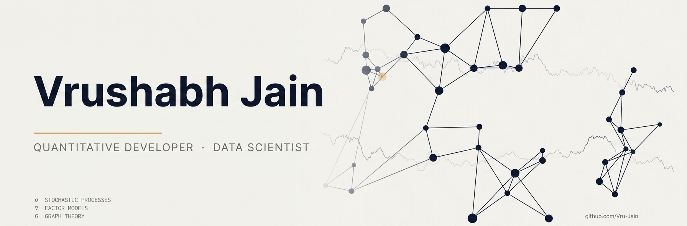

  

  
  &nbsp;
  
  &nbsp;
  

---

## About

I build computational tools at the intersection of quantitative finance and data engineering. My work focuses on portfolio optimization, probabilistic modeling, and the design of systems that turn raw market data into structured, actionable insight.

My current research centers on **Cognitive Graph Portfolio Optimization (CGPO)** : a framework that combines graph theory and cognitive computing to optimize asset allocation and minimize portfolio risk in non-stationary markets.

Outside of that, I work on stochastic process theory, derivative pricing models, and the infrastructure side of financial pipelines: data ingestion, factor construction, and backtesting architecture.

---

## Featured Research

### Cognitive Graph Portfolio Optimization (CGPO)

An adaptive portfolio allocation framework that integrates graph theory with cognitive computing. The project models asset relationships as dynamic networks to optimize risk-adjusted returns in non-stationary markets.

**Technical Core**
- **Graph Engine** — network-based asset dependency modeling.
- **Market Environment** — custom simulation logic for regime-switching scenarios.
- **Optimization** — algorithms for strategic portfolio rebalancing and risk mitigation.

---

## Systems & Infrastructure

Beyond CGPO, these prove out the engineering side of quant work — a matching engine, a pricing library, and the infrastructure to test and feed strategies. Each is verifiably correct: real test suites, cross-checked against known values, and honest about what didn't work.

| Project | What it proves |
|---|---|
| [orderbook-engine](https://github.com/Vru-Jain/orderbook-engine) | C++17 limit order book, price-time priority matching, O(1) cancellation, ~3.5M orders/sec |
| [options-pricing-lib](https://github.com/Vru-Jain/options-pricing-lib) | Black-Scholes, binomial tree, Monte Carlo & implied vol — cross-validated three independent ways |
| [backtest-engine](https://github.com/Vru-Jain/backtest-engine) | Event-driven backtester with a structurally provable no-look-ahead guarantee |
| [stat-arb-research](https://github.com/Vru-Jain/stat-arb-research) | Cointegration + GARCH + pairs signal research, reported honestly — including a negative out-of-sample result |
| [market-feed-handler](https://github.com/Vru-Jain/market-feed-handler) | Real-time Binance order book reconstruction with latency instrumentation |

---

## Market Pulse

> Tracks four indices relevant to my research universe. Auto-updated every 6 hours on trading days via GitHub Actions.

<!-- START MARKET_DATA -->
| Index | Price | Change |
|---|---:|---:|
| S&P 500 | 7,710.44 | &#9660; -0.48% |
| NASDAQ | 26,468.54 | &#9660; -0.43% |
| Nifty 50 | 23,897.70 | &#9650; +0.10% |
| Gold | 4,488.40 | &#9660; -0.07% |

Last updated: 2026-09-04 15:39 UTC
<!-- END MARKET_DATA -->

---

## Technical Skills

**Quantitative & Mathematical**
- Portfolio optimization: mean-variance, Black-Litterman, factor models, shrinkage estimation
- Stochastic calculus, Black-Scholes framework, Monte Carlo simulation
- Statistical inference, time-series analysis, regime-switching models
- Risk metrics: VaR, CVaR, Sharpe ratio, Sortino ratio, maximum drawdown

**Programming & Scripting**

  
  
  
  

**Data Science & Machine Learning**

  
  
  
  
  

**Infrastructure & DevOps**

  
  
  
  

---

## Contribution Graph

  

---

  Open to full-time quantitative developer and quantitative research roles, and open-source collaboration on financial tools.

